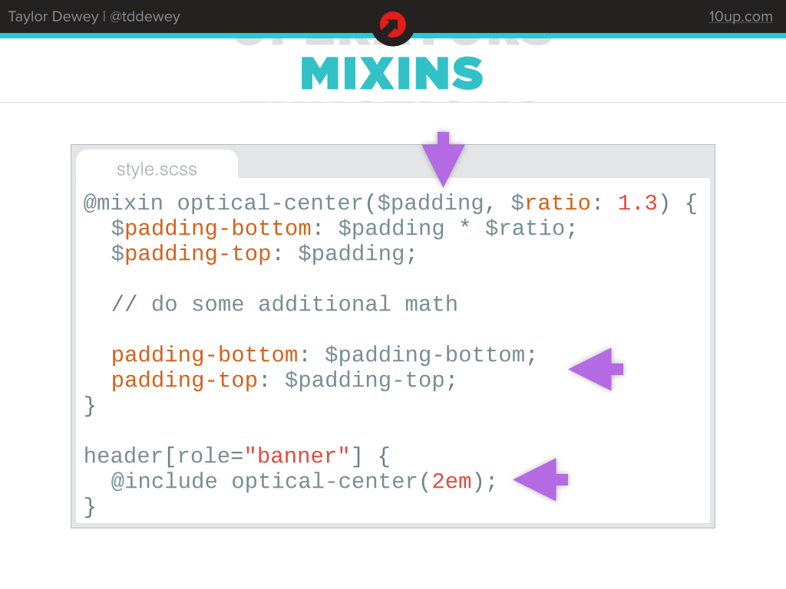

SASS: More than just variables in your CSS
=============================

SASS — Syntactically Awesome Stylesheets — extends CSS by giving us powerful tools that typically exist only in programming languages.

----

That’s some incredible power. Things like variables, control structures, functions, and some CSS-specific things like mixins, which we’ll look into later.

It’s important to know that SASS is written and processed into CSS in our development environment. Put another way: the result of writing SASS is CSS.

Typically when talking about SASS presenters will spend the majority of the presentation talking about how to get started and halfway through the presentation is when they just start getting to the good stuff. We’re going to start with the good stuff, and I’ll let you take a look at [the SASS documentation](http://sass-lang.com/documentation/) to get started.

----

Let’s start with Variables. And yeah, I said that SASS is “more than just variables in your css,” and that’s true. But everything starts here, so it’s important everyone is on the same page.

This is the example we’ll use. It’s a simple design where we use a single color (`#914614`) to represent the background color on one side and the text color on another.

----

In CSS, we would write that hex color (`#914614`) twice: once for the background color and once for the text color. On a large project, we might write that color ten-thousand times.

SASS variables let us assign that color to a variable (see the dollar sign, `$`, that means color-primary is a variable). Once we have a variable we can use the variable all over the place instead. SASS variables can be any type of value: colors, text, numbers, booleans. They’re the building block for a lot of other functionality.

**TRY [Example](http://sassmeister.com/gist/e66ed04cf36e58f0f2bd):**

Open our example in Sassmeister (a way to preview and play with SASS) and change `$color-primary` to your favorite color. Note how the inverted block and the paragraph color both change in response.

----

Using this same example, let’s introduce another concept: extends.

`.inverted-block` is a pretty lousy class name since it describes the styles being applied. Ideally class names have meaning, they describe the item they’re being applied to. Instead of `.inverted-block`, we’ll say `.join-now`. But what if I have `.join-now` and `.buy-now` that both need to use the same styles? We could apply both the join-now class and the buy-now class… but SASS is more powerful than that.

Instead, we’ll use what’s called a placeholder class (see the `%` sign?). This lets us create a bunch of styles using descriptive like inverted-block and then apply classes to it using the `@extend` syntax.

**TRY [Example](http://sassmeister.com/gist/bd6faebe88ee90a0235a):**

See how inverted-block never shows up in the output CSS? That’s because of the % sign. Instead, everything that extends inverted-block will have it’s selector put there instead. Try adding a `.buy-now` class that extends `%inverted-block` and look at the resulting CSS, see how they’re linked together with a comma? You can add a rule to `.buy-now` (e.g. `color: blue`). It will still group `.buy-now` and `.join-now`, but with an added exception for the color blue.

----

Here’s an example of using placeholder classes and `@extend` for a commonly used case: Clearfix. Instead of using a non-semantic `.clearfix` or `.cf` class we can use placeholder classes.

----

Switching gears a little bit, we’re going to talk about mixins. This concept is similar to placeholder classes (extends) in that it allows us to re-use blocks of CSS. The difference is subtle, but important.

To demonstrate this, we’ll use an example of a technique called optical centering. The idea is to give a bit of extra whitespace below content in a box to reduce visual tension. In this example, we’re going to add a bit of padding to the top of an element and a bit more to the bottom.

----

In our header, at the bottom of this example, we’re going to `@include` all the CSS that the optical-center mixin generates. Mixins are different from placeholder classes in that they take parameters that the mixin uses to change it’s output. In this case, we’re going to pass in `2em`.

At the top of the example, we’re declaring a mixin using the syntax `@mixin`, then giving it an arbitrary name (we chose optical-center for this example). A mixin can then take any number of parameters separated by commas. We’re accepting `2em` from earlier and assigning that to the `$padding` variable. (We can also accept an optional `$ratio` variable which defaults to 1.3, but that’s not used in this example).

Inside of the mixin we’ve got a few additional variables, `$padding-bottom` and `$padding-top` which are used to temporarily store values while we do some math on them.

Finally we have some actual CSS. padding-bottom and padding-top along with some values that are computed based upon the `2em` that we passed into it. These values will be output exactly where `@include` is called below.

**TRY [Example](http://sassmeister.com/gist/ba97602947bd806bbc32):**

Load up the example and note how the resulting CSS looks. Change `2em` to something larger, smaller. Perhaps a different unit altogether (try `5%` or `50px`). You’re also welcome to change the math if you’re so inclined, perhaps make a 90° optical-center mixin for someone laying on their side.

The full mixin is on [gist](https://gist.github.com/tddewey/8452b83b249263233357)

----

Extending classes and including mixins both have the same purpose: writing CSS once and having it apply to multiple locations. There’s a very easy way to choose which one to use.

By default, use a placeholder class. Use mixins if either of these two circumstances are true:
* Things are basically the same, but the output needs to be able to change if I give it slightly different parameters.
* The placeholder class would need to be available both inside and outside a media query. Since that’s basically impossible (think of how a placeholder class works), use an include instead or refactor your CSS.

----

In this example, with some very colorful navigation, we’re going to introduce four new concepts:
* SASS Maps
* Control Structures (`@each`)
* Variable Interpolation
* Functions

----

Variables can contain a single value as we saw earlier, a list of values (such as you might find in CSS shorthand notation value for `border: 1px solid blue`), or a new type of construct called a map. For those familiar with other programming languages you might call this a dictionary or an array.

A SASS map contains keys and values. The keys in this example are the items in our navigation: max, bus, streetcar, and bicycle. For each of those items we’re going to give it a value of it’s associated color. We’re using a SASS map rather than create a new variable for each color. Now let’s look at how to use those colors.

----

There are two ways to get values out of a map, the first way is to loop through every item, which is precisely what we need to do for our menu. For each item in the map (max, bus, streetcar, bicycle) let’s create a class with the same name and assign it some colors.

We’re going to use the control structure `@each` which has some complex syntax. Here’s another way to read this: For each item in `$colors` assign the item’s key to a variable `$name` and the item’s value to a variable `$color` and create some CSS. This will loop through each item in colors and for each item we’ll have access to the name of the item (max, bus streetcar, bicycle) as `$name` and its corresponding color as `$color`.

So for each item, we want to output a class with the `$name`. Unfortunately SASS would not see the variable if we put it next to the class selector and our resulting CSS would be broken so we need to do the funky `#{$variable}` notation, called interpolation. The hashtag and curly braces allow us to put a variable right next to other text. We’ll get a class for each item in our list: `.max`, `.bus`, `.streetcar`, and `.bicycle`.

For each of those classes we’re going to give it a background color and a border. The border will be 8px, solid, and with the `$color` of that item. The background color is going to be manipulated a little bit with the SASS function `darken()`. Like mixins, functions take parameters. Unlike mixins, they return a single value instead of CSS. In this case, we are going to darken the `$color` by 10% which will give us a different, darker color.

You can see a list of all built-in SASS functions in the [Sass Documentation](http://sass-lang.com/documentation/Sass/Script/Functions.html) — and you can also build your own, which is the second way we’ll use our `$colors` map.

**But first, TRY [Example](http://sassmeister.com/gist/69702f15c70340793a13):**

MAX is introducing the new orange line. For the occasion, make the max item orange. We also need to add “jetpack” to our lineup. Add `‘jetpack’` and a corresponding color to the map. Then also add a new `<li>` in our HTML to make full use of it.

----

Here’s a contrived example of both a custom function and another way to get values out of a SASS map. We can create custom functions — remember functions take parameters and produce individual values — by using the `@function` syntax. In this example, we’re creating a function arbitrarily called random-color. It doesn’t take any parameters and it returns a random color from our `$colors` map. I’ll walk through what it’s doing line-by-line.

1. Define a variable `$integer` and use the built-in random function to provide a random integer between 1 and the length — number of items inside — of the `$colors` map.
1. Use the sass-function `map-keys()` to get all of the keys in our `$colors` map and assign that list to the variable `$keys`. Remember the keys are max, bus, streetcar, bicycle, and maybe jetpack.
1. Get a random key from `$keys`. The built-in function `nth()` gets an item from a list given a numerical index. The list is `$keys`, and `$integer` holds the number of the item we want. What’s behind door number three? `nth( $doors, 3)`
1. Finally we use `map-get()`, a build-in sass function, to get the value from a map if we give it a key. We’re going to give it our `$random-key`, tell it to get the corresponding value from the `$colors map`.

In this example, we set the background-color to whatever color the `random-color()` function gives us.

So this is a contrived example, but it allows us to demonstrate, in a fun way, a custom function and a number of built-in functions. It’s also useful for demonstrating the pre-processed nature of SASS. This function provides us a `random-color()` when the SASS is processed. _Not_ on every page-load. For your visitors, this is not random. The background-color will only change when you, as a developer, makes a change to the SASS, processes it, and uploads the new resulting CSS file to your server.

**TRY [Example](http://sassmeister.com/gist/9273d4b26e9dda9e9b5a):**

Change the SASS — even just adding whitespace works — to see a new random background color generate. Want really random colors? Create a new function that will `@return rgb( random(255), random(255), random(255));`

----

`@each` isn’t the only placeholder. There is also if, for, and while. I don’t have any examples, but [the SASS documentation](http://sass-lang.com/documentation/file.SASS_REFERENCE.html#control_directives__expressions) is a good place to start reading up on them.

----

In conclusion, SASS offers immense power, but with that comes some responsibility to learn and understand how to use it. Hopefully this was some incentive to do so.

**Want more?**

* [The official SASS website](http://sass-lang.com)
* An [in-code SASS tutorial](http://github.com/tddewey/coffee-shop-sass-example) I wrote.
* Some really cool, and not-so-cool, [examples of stuff done in SASS](http://codepen.io/search?q=sass&limit=all&order=popularity&depth=everything&show_forks=false).